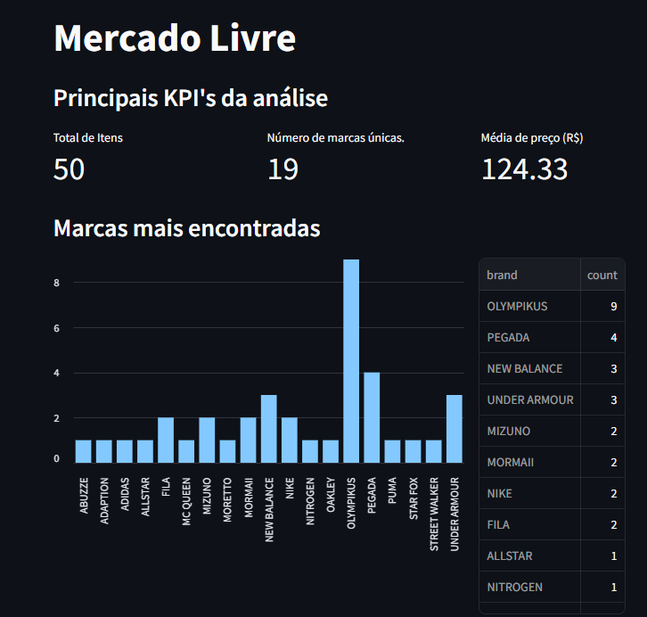
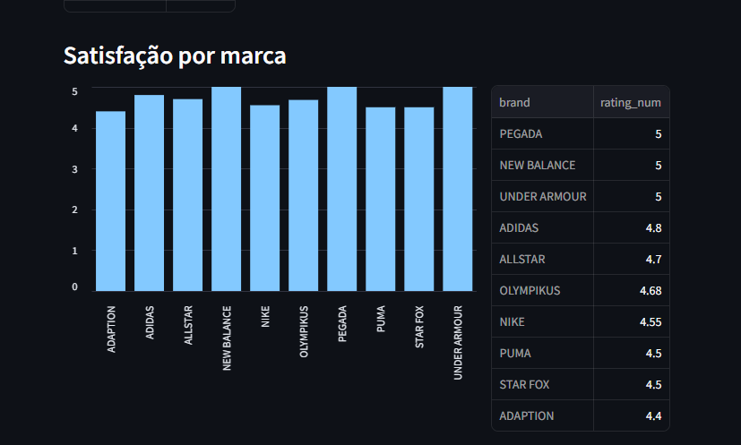

# Visão Geral
O projeto foi criado com intúito de comparar itens nas principais 
lojas online nesse período de black fride. A fim de analisar qual empresa está se destacando mais no mercado.
## Status 
Projeto ainda está em andamento

# Funcionalidades
- Coleta de dados dos produtos das principais empresas de vendas online
- Transformação e tratamento dos dados 
- Análise de dados atráves de dashbords
#
# Instalação

### 1. Clone o repositório
- ```bash
    git clone https://github.com/Rafael-Levi/WebScraping-BlackFriday
    ``` 
### 2. Instale o poetry
-   ```bash
    pip install poetry
    ```
### 3. Instale as dependências
- ```bash
    poetry install
    ```
### 4. Comando para coleta dos dados
-   ```bash
    task scrapy
    ```
### 5. Comando para gerar dashbords
-   ```bash
    task dash
    ```

# Análises iniciais 


